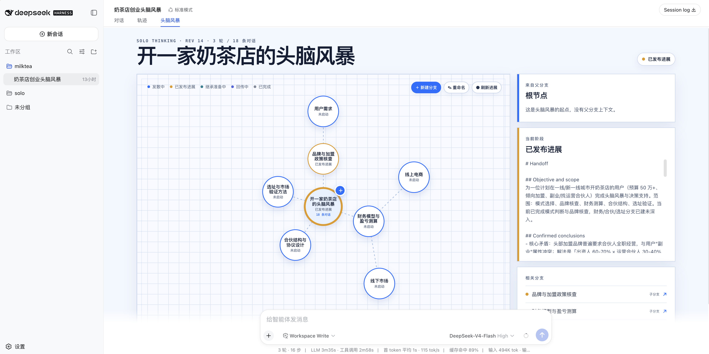
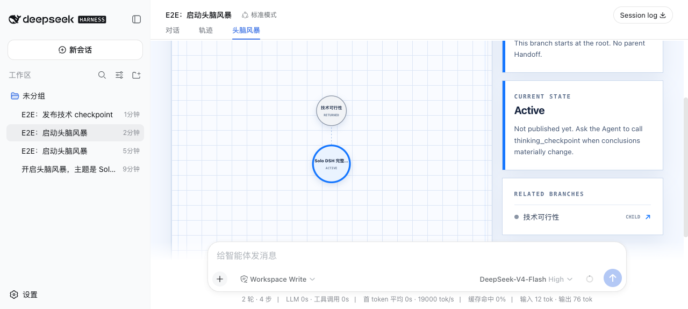

# DSH Solo Thinking

把头脑风暴拆成一棵可操作的思考树：每个方向都是独立的 DeepSeek Harness Session，分支之间只交换 Agent 主动撰写的 Handoff。

> Solo-style isolated brainstorm branches, automatic Handoffs, and a visual thinking tree for DeepSeek Harness.



## 核心能力

- 默认建议模式：信息足够时自动创建 2–4 个真正独立的方向，优先 4 个，不为凑数而分裂。
- 独立 Session：每个节点拥有自己的对话、状态和生命周期，建议节点先休眠，收到第一条消息后才启动。
- 自动 Handoff：分裂继承、Current State、兄弟感知和 Return 总结均由 Agent 自动撰写，用户不需要手写。
- Workspace 继承：分支持久化挂在父 Session 所属 Workspace，不落入“未分组”。
- 输入不串线：主输入框只发给当前 Session；思考树可直接向选中的其他分支发送；只有“进入对话”会导航。
- 可回放持久化：树状态写入 DSH append-only Session 事件并通过 Projection 恢复。

## 兼容性

| 环境 | 支持情况 |
|---|---|
| 官方 DSH `0.1.0-rc.6` | Thinking 工具、自动建议、分支 Session、Handoff、Workspace 继承和完整“头脑风暴”标签页 |
| 应用本仓库可选宿主补丁的 DSH | 在上述能力之外增加 Solo 式对话右栏，并向 Host 注册插件持久化事件类型 |

插件不会覆盖官方工具详情。官方 DSH 没有 `conversation.details.aux` 时会自动降级到“头脑风暴”标签页；右栏补丁及其精确适用版本见 [`patches/README.md`](patches/README.md)。

## 安装

要求 Node.js `^22.19.0 || >=24.0.0` 和 DSH `0.1.0-rc.6`。

### 从 GitHub 安装

仓库提交预构建 `lib/`，安装时不执行构建脚本，也不需要 pnpm `allowBuilds`：

```bash
dsh plugin --profile web add github:fredalxin/dsh-plugin-solo-thinking#v0.1.17
dsh --profile web --dump-config
dsh --profile web
```

源码运行 DSH 时，把命令中的 `dsh` 换成 `pnpm dsh`。

### 从 GitHub Release 安装

下载 Release 中的 `dsh-plugin-solo-thinking-0.1.17.tgz` 后执行：

```bash
dsh plugin --profile web add ./dsh-plugin-solo-thinking-0.1.17.tgz
dsh --profile web
```

### 从源码构建

```bash
npm ci
npm run verify
npm pack
dsh plugin --profile web add ./dsh-plugin-solo-thinking-0.1.17.tgz
```

卸载：

```bash
dsh plugin --profile web remove dsh-plugin-solo-thinking
```

## 30 秒开始使用

在普通 DSH 对话里说：

```text
开启头脑风暴，主题是“给独立开发者做一个本地 AI 工作台”。
请先发散；如果有多个值得独立深挖的方向，直接建立建议分支。
```

Agent 会调用 `thinking_start`，随后在适合分裂时调用一次 `thinking_suggest`。建议分支只创建、不自动运行；点击节点可查看 Handoff，直接在树中发消息即可启动该分支。

## 思考树操作

- `＋ 分裂`：只填写方向名称；父 Agent 自动为新节点准备定向 Handoff。
- `● 进展`：让当前分支从自己的完整对话整理 Current State，供兄弟分支下一次模型轮读取。
- `✓ 回传`：分支 Agent 撰写最终 Handoff，返回父节点并封存当前分支。
- `进入对话`：显式导航到该 Session；单击节点本身只选择，不跳转。
- 分支输入框：给非当前分支发消息，主会话仍停留在中间。

Handoff 使用简短 Markdown，覆盖目标、已确认结论、证据、风险、开放问题和下一步。兄弟分支与父分支不会被后台自动唤醒，而是在自己的下一次显式模型轮消费最新 Handoff。



## Thinking 工具

| 工具 | 用途 |
|---|---|
| `thinking_start` | 在当前 Session 建立头脑风暴空间 |
| `thinking_suggest` | 一次创建 2–4 个休眠建议方向 |
| `thinking_split` | Agent 自主分裂并写入定向 Handoff |
| `thinking_fork_handoff` | 为人工创建的待继承节点补齐父分支 Handoff |
| `thinking_checkpoint` | 发布本分支 Current State |
| `thinking_return` | 向父分支提交最终 Handoff 并封存 |
| `thinking_status` | 读取当前节点和整棵树状态 |

## 数据与安全边界

- 插件不调用外部网络服务，不读取其他分支的原始对话。
- 跨分支信息只来自显式 Handoff；发送目标由 DSH Session ID 隔离。
- 状态随 DSH Session persistence 保存；卸载插件不会主动删除历史 Session 数据。
- GitHub 安装使用提交进仓库的预构建产物，不执行第三方安装脚本。生产环境仍建议固定 tag 或 commit。

## 开发与验证

```bash
npm ci
npm run check
npm test
npm run verify
```

完整 Web E2E 使用受控 Provider，但仍经过真实 DSH adapter、Agent loop、Tools、Session persistence、Projection 和 Web RPC：

```bash
# 终端 A
SOLO_E2E_PROVIDER_KEY=solo-e2e-key npm run e2e:provider

# 终端 B
DEEPSEEK_BASE_URL=http://127.0.0.1:8000/v1 \
DEEPSEEK_API_KEY=solo-e2e-key \
dsh --profile web --patch ./scripts/e2e.patch.yml

# 终端 C
npm run e2e:run
```

成功测试会验证：4 个休眠建议分支、Workspace 继承、Agent-authored split/checkpoint Handoff、Return、父 Session notice，以及冷启动恢复。完整说明见 [`docs/E2E.md`](docs/E2E.md)，设计边界见 [`docs/ARCHITECTURE.md`](docs/ARCHITECTURE.md)。

## 与完整 Solo 的边界

本插件只移植 Thinking 的核心不变量，不移植 Solo 的 Channel、Team Agent 关系、PostgreSQL、daemon 或 CLI 管理：

- DSH Session 代替 Thinking Node 的独立消息作用域；
- DSH persistence 代替进程池和数据库绑定；
- DSH Tool 与 System Prompt context 代替 Handoff 控制协议；
- DSH Conversation View / 可选右栏插槽代替整页 Channel 工作区。

## License

[MIT](LICENSE)
